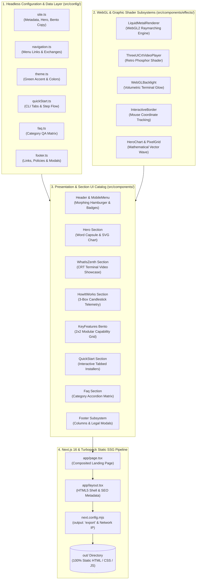

<div align="center">


<p align="center">
  <strong>Modern, high-performance web platform and visual showcase for Zenth — featuring WebGL 2 liquid metal physics shaders, hardware-accelerated retro CRT video rendering, interactive SVG wave charts, and zero-config static site export.</strong>
</p>

<p align="center">
  <a href="https://nextjs.org/"></a>
  <a href="https://react.dev/"></a>
  <a href="https://tailwindcss.com/"></a>
  <a href="https://www.typescriptlang.org/"></a>
  <a href="https://www.khronos.org/webgl/"></a>
  <a href="https://turbo.build/pack"></a>
  <a href="https://nodejs.org/"></a>
  <a href="#license"></a>
</p>

<p align="center">
  <a href="#getting-started">Quick Start</a> •
  <a href="#key-features">Key Features</a> •
  <a href="#architecture-and-project-structure">Architecture</a> •
  <a href="#tech-stack">Tech Stack</a> •
  <a href="#visual--shader-subsystems">Shader Subsystems</a> •
  <a href="#component-architecture--section-catalog">Component Catalog</a> •
  <a href="#configuration--customization">Configuration</a> •
  <a href="#deployment-guides">Deployment</a> •
  <a href="#license">License</a>
</p>

</div>

---

## Table of Contents

- [Overview](#overview)
- [Key Features](#key-features)
  - [1. WebGL 2 Liquid Metal Physics Shader Engine](#1-webgl-2-liquid-metal-physics-shader-engine)
  - [2. Hardware-Accelerated CRT Retro Terminal Video Showcase](#2-hardware-accelerated-crt-retro-terminal-video-showcase)
  - [3. High-Frequency Technical SVG Wave Chart & Vector Pixel Grid](#3-high-frequency-technical-svg-wave-chart--vector-pixel-grid)
  - [4. Interactive Autonomous Signal Pipeline 3-Box Telemetry Widget](#4-interactive-autonomous-signal-pipeline-3-box-telemetry-widget)
  - [5. Bento-Grid Capability Showcase & Glassmorphic Highlights](#5-bento-grid-capability-showcase--glassmorphic-highlights)
  - [6. Mobile-First Glassmorphic Navigation & Morphing Controls](#6-mobile-first-glassmorphic-navigation--morphing-controls)
  - [7. Zero-Config Static Site Generation (SSG) & Turbopack Core](#7-zero-config-static-site-generation-ssg--turbopack-core)
- [Architecture and Project Structure](#architecture-and-project-structure)
  - [Architecture Overview](#architecture-overview)
  - [Component Hierarchy & Rendering Flow](#component-hierarchy--rendering-flow)
  - [Directory & File Layout](#directory--file-layout)
- [Tech Stack](#tech-stack)
  - [Framework, Core Runtime & Bundler](#framework-core-runtime--bundler)
  - [Graphics, WebGL Shaders & Canvas API](#graphics-webgl-shaders--canvas-api)
  - [Styling, Design Tokens & Animation](#styling-design-tokens--animation)
  - [Development Tooling & Linters](#development-tooling--linters)
- [Visual & Shader Subsystems](#visual--shader-subsystems)
  - [A. Liquid Metal Raymarching & Physics Engine](#a-liquid-metal-raymarching--physics-engine)
  - [B. Retro CRT Terminal Video Player & Backlight Renderer](#b-retro-crt-terminal-video-player--backlight-renderer)
  - [C. SVG Candlestick & Technical Marketcap Canvas](#c-svg-candlestick--technical-marketcap-canvas)
- [Component Architecture & Section Catalog](#component-architecture--section-catalog)
  - [1. Header & Navigation Subsystem](#1-header--navigation-subsystem)
  - [2. Hero Section](#2-hero-section)
  - [3. What Is Zenth Section](#3-what-is-zenth-section)
  - [4. How It Works Section](#4-how-it-works-section)
  - [5. Key Features Bento Section](#5-key-features-bento-section)
  - [6. Quick Start Installation Section](#6-quick-start-installation-section)
  - [7. FAQ Accordion Section](#7-faq-accordion-section)
  - [8. Footer & Legal Modals Subsystem](#8-footer--legal-modals-subsystem)
- [Getting Started](#getting-started)
  - [1. Prerequisites & Installation](#1-prerequisites--installation)
  - [2. Local Development Server](#2-local-development-server)
  - [3. Production Build & Static Export (SSG)](#3-production-build--static-export-ssg)
  - [4. Static Preview Server](#4-static-preview-server)
- [Configuration & Customization](#configuration--customization)
  - [Site Metadata & Headless Config (`site.ts`)](#site-metadata--headless-config-sitets)
  - [Color Palette & Theme Tokens (`theme.ts`)](#color-palette--theme-tokens-themets)
  - [Interactive Command Tabs & Setup Guides (`quickStart.ts`)](#interactive-command-tabs--setup-guides-quickstartts)
  - [Technical FAQ Matrix (`faq.ts`)](#technical-faq-matrix-faqts)
  - [Footer Links & Legal Policies (`footer.ts`)](#footer-links--legal-policies-footerts)
- [Deployment Guides](#deployment-guides)
  - [GitHub Pages (Static Export)](#github-pages-static-export)
  - [Vercel](#vercel)
  - [Netlify](#netlify)
  - [Cloudflare Pages](#cloudflare-pages)
  - [Docker / Nginx Static Web Server](#docker--nginx-static-web-server)
- [Performance & Accessibility Optimizations](#performance--accessibility-optimizations)
- [License](#license)

---

## Overview

The **Zenth Website** (`zenth-website`) is a cutting-edge web platform and interactive landing platform engineered for the [Zenth Autonomous Crypto Paper Trading Terminal](https://github.com/IMROVOID/Zenth). Built with **Next.js 16 (App Router)**, **React 19**, **Tailwind CSS v4**, and **TypeScript 5.7**, the website delivers an institutional cyber/matrix developer aesthetic with zero compromises on performance, accessibility, or rendering fidelity.

The platform integrates custom **WebGL 2.0 liquid metal physics shaders**, **hardware-accelerated retro CRT phosphor video filters**, **mathematically aligned SVG vector wave charts**, and **responsive bento grid layouts** — all compiled to **pure static HTML/CSS/JS** with zero server-side dependencies.

```
+──────────────────────────────────────────────────────────────────────────────────────────────────+
|                                    ZENTH WEB PLATFORM MATRIX                                     |
+──────────────────────────┬──────────────────────────┬─────────────────────────┬──────────────────+
| Visual Shaders           | Interactive Charts       | UI / UX Engine          | Delivery Mode    |
+──────────────────────────┼──────────────────────────┼─────────────────────────┼──────────────────+
| WebGL 2 Liquid Metal     | SVG Multi-Wave Waveform  | Bento Grid Layouts      | Next.js 16 SSG   |
| Hardware CRT Scanlines   | Bull/Bear Candlesticks   | Glassmorphism Overlays  | Zero Server Cost |
| Volumetric Light Rays    | Vector-Clipped Pixels    | Morphing Mobile Nav     | 100% Static HTML |
+──────────────────────────┴──────────────────────────┴─────────────────────────┴──────────────────+
```

---

## Key Features

### 1. WebGL 2 Liquid Metal Physics Shader Engine
- **Real-Time Interactive Physics**: Interactive cursor tracking, velocity calculation, pressure wave dispersion, and dynamic ripple damping (`ripArr` float buffer).
- **Multi-Pass Shader Pipeline**: Full vertex/fragment rendering stack executing `ScenePass`, `RimPass`, `DownsamplePass`, `GaussianDualBlurPass`, and `CompositePass`.
- **Deferred Shader Compilation**: Heavy raymarching scene programs defer compilation until `requestIdleCallback` or idle timeout, ensuring instantaneous Initial Page Load and zero First Input Delay (FID).
- **Graceful Fallbacks**: Automatically checks WebGL2 floating-point color buffer extensions (`EXT_color_buffer_float`, `EXT_color_buffer_half_float`) with automatic standard precision fallbacks.

### 2. Hardware-Accelerated CRT Retro Terminal Video Showcase
- **Curved Phosphor Barrel Distortion**: Emulates vintage cathode-ray tube screen curvature and chromatic dispersion.
- **Sweeping Refresh Scan Beam**: Hardware-accelerated scanline sweep (`crtScanBeam`) and RGB triad phosphor mask.
- **Dynamic WebGL Backlight**: Dual top/bottom reactive backlight glows dynamically matching terminal playback intensity.
- **Zero-Layout-Shift Aspect Ratios**: Automatically reads video metadata dimensions (`loadedmetadata`) to mathematically lock container aspect ratio before video decoding begins.

### 3. High-Frequency Technical SVG Wave Chart & Vector Pixel Grid
- **Mathematically Locked Pixel Grid**: Dot matrix grid clipped precisely to the under-curve area geometry of the primary cubic Bézier wave path (`CHART_PATH_D`).
- **Multi-Stop Vector Gradients**: Gradient strokes with 10-stop tone transitions (`#0a0a0a` to `#2CE88A` to `#4ADE80`) simulating high-frequency oscilloscope signals.
- **Dual-Layer Bloom Glow**: Layer-cached (`translateZ(0)`) blur filters rendering outer ambient glow (`blur(4px)`) and mid-bloom (`blur(1.5px)`) without CPU rasterization overhead.

### 4. Interactive Autonomous Signal Pipeline 3-Box Telemetry Widget
- **Side-by-Side Responsive Layout**: Auto-adapts from horizontal 3-column desktop layout (`col-span-3`, `col-span-6`, `col-span-3`) to mobile stacked grid.
- **Live Candlestick Visualization**: 24-period OHLCV candlestick graphic with bull/bear fills, wicks, and glow-bordered `[BUY]` / `[SELL]` execution badges.
- **Institutional Telemetry Badges**: Real-time stats display for Candlestick Ingestion, Active Indicator Loops (SMA 9/21 + RSI 14), Adaptive Risk Rules, and Order Execution Speed (< 12ms).

### 5. Bento-Grid Capability Showcase & Glassmorphic Highlights
- **2x2 Modular Bento Layout**: Showcases the 4 pillars of Zenth: Institutional Risk ($1,000 Cap), Self-Learning Adaptive Memory, Pluggable Multi-Exchange Ingestion (6 Venues), and Multi-Format Exporters (PDF/DOCX/CSV/MD).
- **Interactive Mouse-Tracking Border**: `InteractiveBorder` component tracks cursor `(x, y)` coordinates to project a radiant green specular accent on hovered borders.
- **Pure Vector Custom Illustrations**: Bespoke SVG illustrations for memory neural links, multi-currency balance cards, security shields, and candlestick telemetry.

### 6. Mobile-First Glassmorphic Navigation & Morphing Controls
- **Smooth Morphing Hamburger-to-X Button**: 3-bar hamburger icon smoothly transforms into an "X" with simultaneous rotation, scale, and opacity keyframes.
- **Full-Screen Blur Overlay**: Responsive mobile navigation drawer with dark glassmorphic backdrop (`backdrop-blur-2xl bg-black/90`).
- **Dynamic Star Counter**: Embedded live GitHub stars badge fetching repository stargazers asynchronously with fallback formatting.

### 7. Zero-Config Static Site Generation (SSG) & Turbopack Core
- **Static Export Output**: Built with `output: 'export'` producing production-ready, highly optimizable static assets in the `out/` folder.
- **Turbopack Dev Engine**: Blazing fast cold starts and instant Hot Module Replacement (HMR) powered by Next.js Turbopack.
- **Tailwind CSS v4 Engine**: Utilizes modern `@import "tailwindcss";` CSS-first configuration with zero legacy configuration overhead.

---

## Architecture and Project Structure

### Architecture Overview

The Zenth website is structured around a **decoupled, config-driven component architecture**. All user-facing copy, links, exchanges, telemetry numbers, and legal policies live in typed configuration modules (`src/config/`), cleanly separating business data from rendering logic, shader physics, and UI components.



### Component Hierarchy & Rendering Flow

```
app/layout.tsx (Root HTML, Dark Mode, Meta SEO, Global CSS)
└── app/page.tsx (Main Composition Container)
    ├── <Header />
    │   ├── <BrandLogo />
    │   ├── <NavMenu />
    │   ├── <GithubStarBadge />
    │   ├── <LiquidMetalButton text="Get Started" />
    │   └── <MobileMenu />
    │
    ├── <Hero />
    │   ├── <LightRay color="#2CE88A" />
    │   ├── <HeroWordCapsule words={['Crypto', 'Stocks']} />
    │   ├── <HeroPillButton />
    │   ├── <LiquidMetalButton text="Documentation" />
    │   └── <HeroChart />
    │       └── <PixelGrid areaD={...} />
    │
    ├── <WhatIsZenth />
    │   ├── <SectionHeading />
    │   └── <ThreeUICrtVideoPlayer />
    │       ├── <WebGLBacklight position="top" />
    │       ├── <canvas ref={canvasRef} /> (CRT WebGL2 Shader)
    │       └── <WebGLBacklight position="bottom" />
    │
    ├── <HowItWorks />
    │   ├── <HowItWorksHeading />
    │   └── <WidgetContainer />
    │       ├── <SideStatCard stats={leftStats} />
    │       ├── <InteractiveChartWidget />
    │       │   └── <BullBearChartCanvas />
    │       │       ├── <ChartSignalBadge marker="BUY" />
    │       │       └── <ChartSignalBadge marker="SELL" />
    │       └── <SideStatCard stats={rightStats} />
    │
    ├── <KeyFeatures />
    │   ├── <KeyFeaturesHeading />
    │   └── <KeyFeaturesGrid />
    │       ├── <FeatureCard id="security" illustration={<AdvancedSecurityIllustration />} />
    │       ├── <FeatureCard id="ecosystem" illustration={<AdaptiveMemoryIllustration />} />
    │       ├── <FeatureCard id="analytics" illustration={<RealTimeAnalyticsIllustration />} />
    │       └── <FeatureCard id="multicurrency" illustration={<MultiCurrencyCardsIllustration />} />
    │
    ├── <QuickStart />
    │   ├── <QuickStartHeading />
    │   ├── <InstallCommandTabs />
    │   │   ├── <InstallSegmentedControls />
    │   │   └── <InstallCommandBody />
    │   ├── <QuickStartStepsGrid />
    │   │   └── <StepCard step="01" | "02" | "03" />
    │   └── <DocsCtaCard />
    │
    ├── <Faq />
    │   ├── <FaqHeader />
    │   ├── <FaqAccordionList />
    │   │   └── <FaqAccordionItem key={item.id} />
    │   └── <SupportCtaCard />
    │
    └── <Footer />
        ├── <FooterBrand />
        ├── <FooterNavGrid />
        ├── <FooterLegalDisclaimer />
        ├── <FooterBottomBar />
        └── <LegalModal modalType="privacy" | "terms" />
```

### Directory & File Layout

```
website/
├── public/                          # Static public web assets
│   ├── favicon.ico                  # Site favicon
│   ├── images/                      # Optimized image assets
│   │   ├── light-ray.webp           # Volumetric light ray texture
│   │   ├── logo.svg                 # Vector brand logo mark
│   │   └── logos/                   # Exchange brand logos
│   │       ├── binance.svg          # Binance logo
│   │       ├── bitget.svg           # Bitget logo
│   │       ├── coinbase.svg         # Coinbase logo
│   │       ├── kucoin.svg           # KuCoin logo
│   │       ├── okx.svg              # OKX logo
│   │       └── xt.svg               # XT.com logo
│   └── videos/                      # Terminal video previews
│       └── Zenth-V1.0.0.mp4         # High-resolution TUI recording
│
├── src/                             # Source code root
│   ├── app/                         # Next.js App Router root
│   │   ├── favicon.ico              # App route favicon
│   │   ├── layout.tsx               # Root HTML document shell & SEO metadata
│   │   └── page.tsx                 # Single-page landing compositor
│   │
│   ├── config/                      # Headless configuration modules
│   │   ├── index.ts                 # Unified config barrel export
│   │   ├── site.ts                  # Site metadata, hero, and bento copy
│   │   ├── theme.ts                 # Theme color tokens & accent definitions
│   │   ├── navigation.ts            # Header navigation & exchange items
│   │   ├── quickStart.ts            # CLI tabs, install commands & step guides
│   │   ├── faq.ts                   # FAQ matrix, categories & highlights
│   │   └── footer.ts                # Footer columns, links & legal policies
│   │
│   ├── styles/                      # Global styling & Tailwind v4
│   │   └── globals.css              # Custom keyframes, scrollbars & base layers
│   │
│   └── components/                  # Modular React component hierarchy
│       ├── index.ts                 # Component catalog barrel export
│       │
│       ├── layout/                  # Navigation & footer infrastructure
│       │   ├── Header.tsx           # Responsive top header bar
│       │   ├── BrandLogo.tsx        # Vector brand logo & text
│       │   ├── NavMenu.tsx          # Desktop navigation links
│       │   ├── MobileMenu.tsx       # Glassmorphism full-screen mobile menu
│       │   ├── GithubStarBadge.tsx  # Dynamic GitHub stars badge
│       │   └── footer/              # Footer subsystem
│       │       ├── Footer.tsx       # Main footer container
│       │       ├── FooterBrand.tsx  # Brand tagline & status badge
│       │       ├── FooterNavGrid.tsx# 5-column navigation matrix
│       │       ├── FooterLegalDisclaimer.tsx # Regulatory paper trading notice
│       │       ├── FooterBottomBar.tsx # Attribution & copyright bar
│       │       └── LegalModal.tsx   # Interactive Privacy & Terms modal
│       │
│       ├── hero/                    # Hero section & dynamic word capsule
│       │   ├── Hero.tsx             # Hero section coordinator
│       │   ├── HeroPillButton.tsx   # "Get Started" primary pill button
│       │   ├── HeroWordCapsule.tsx  # Animated looping word capsule
│       │   └── index.ts             # Hero barrel export
│       │
│       ├── chart/                   # Vector wave chart & dot matrix
│       │   ├── HeroChart.tsx        # SVG technical wave chart with bloom
│       │   ├── PixelGrid.tsx        # Under-curve masked dot pixel grid
│       │   ├── chartConstants.ts    # SVG Bézier paths & viewBox definitions
│       │   └── index.ts             # Chart barrel export
│       │
│       ├── what-is-zenth/           # CRT video terminal showcase
│       │   ├── WhatIsZenth.tsx      # Section wrapper & ambient glow
│       │   ├── SectionHeading.tsx   # Pill badge, title & description
│       │   ├── crt/                 # CRT WebGL2 shader pipeline
│       │   │   ├── ThreeUICrtVideoPlayer.tsx # Canvas video player controller
│       │   │   ├── shaders.ts       # CRT barrel distortion & scanline GLSL
│       │   │   └── useCrtRenderer.ts# WebGL canvas animation hook
│       │   └── backlight/           # Reactive ambient backlight
│       │       ├── WebGLBacklight.tsx # Top & bottom backlight canvas
│       │       ├── shaders.ts       # Volumetric radial blur GLSL
│       │       └── useBacklightRenderer.ts # Backlight rendering hook
│       │
│       ├── how-it-works/            # Autonomous execution pipeline widget
│       │   ├── HowItWorks.tsx       # Section wrapper
│       │   ├── HowItWorksHeading.tsx# Section title & description
│       │   ├── WidgetContainer.tsx  # 3-box responsive grid container
│       │   ├── InteractiveChartWidget.tsx # Center candlestick canvas container
│       │   ├── BullBearChartCanvas.tsx # SVG 24-candle OHLCV chart
│       │   ├── ChartSignalBadge.tsx # Glowing BUY/SELL signal indicators
│       │   ├── SideStatCard.tsx     # Left & right telemetry metric boxes
│       │   └── constants.ts         # Candlestick data & SVG geometry
│       │
│       ├── key-features/            # 2x2 Bento Grid capabilities
│       │   ├── KeyFeatures.tsx      # Section wrapper
│       │   ├── KeyFeaturesHeading.tsx # Section title & description
│       │   ├── KeyFeaturesGrid.tsx  # 2x2 responsive bento grid
│       │   ├── FeatureCard.tsx      # Glassmorphism feature card
│       │   └── illustrations/       # Custom vector SVG illustrations
│       │       ├── AdvancedSecurityIllustration.tsx   # Shield & $1k cap
│       │       ├── AdaptiveMemoryIllustration.tsx     # Neural graph & rules
│       │       ├── RealTimeAnalyticsIllustration.tsx  # Multi-exchange chart
│       │       └── MultiCurrencyCardsIllustration.tsx # Touch TUI & export
│       │
│       ├── quick-start/             # Tabbed CLI installer & setup guides
│       │   ├── QuickStart.tsx       # Section wrapper
│       │   ├── QuickStartHeading.tsx# Section title & description
│       │   ├── InstallCommandTabs.tsx # Tabbed terminal installer
│       │   ├── InstallSegmentedControls.tsx # CLI tab selector
│       │   ├── InstallCommandBody.tsx # Syntax highlighted command box
│       │   ├── QuickStartStepsGrid.tsx # 3-step numbered workflow
│       │   ├── StepCard.tsx         # Individual step card
│       │   └── DocsCtaCard.tsx      # Deep documentation CTA banner
│       │
│       ├── faq/                     # Technical question & answer accordion
│       │   ├── Faq.tsx              # Section wrapper
│       │   ├── FaqHeader.tsx        # Section title & description
│       │   ├── FaqAccordionList.tsx # Categorized FAQ list
│       │   ├── FaqAccordionItem.tsx # Expandable animated FAQ item
│       │   └── index.ts             # FAQ barrel export
│       │
│       ├── effects/                 # WebGL2 shaders & ambient effects
│       │   ├── LightRay.tsx         # Volumetric foggy light beam
│       │   ├── InteractiveBorder.tsx# Mouse-following specular border
│       │   └── liquid-metal/        # Liquid metal WebGL2 physics engine
│       │       ├── renderer.ts      # Multi-pass WebGL2 renderer class
│       │       ├── renderPasses.ts  # Scene, Rim, Blur, Bloom & Comp passes
│       │       ├── physics.ts       # Ripple disturbance & pointer math
│       │       ├── webglUtils.ts    # FBO, Texture, Shader & VAO utilities
│       │       ├── useLiquidMetal.ts# React canvas binding hook
│       │       ├── constants.ts     # Default uniforms & parameter keys
│       │       ├── types.ts         # Shader & render target interfaces
│       │       └── shaders/         # GLSL shader program strings
│       │           ├── scene.ts     # Raymarching metal surface shader
│       │           ├── rimComp.ts   # Specular rim highlight shader
│       │           └── common.ts    # Vertex shader & downsample shaders
│       │
│       └── ui/                      # Primitive interactive UI components
│           ├── LiquidMetalButton.tsx# Interactive liquid metal shader button
│           └── index.ts             # UI primitives barrel export
│
├── next.config.mjs                  # Next.js static export & Turbopack config
├── postcss.config.mjs               # PostCSS & Tailwind CSS v4 bridge
├── package.json                     # NPM dependencies & scripts
├── tsconfig.json                    # TypeScript strict compiler config
└── README.md                        # Comprehensive website documentation
```

---

## Tech Stack

### Framework, Core Runtime & Bundler

| Technology / Library | Exact Version | Link | Purpose / Description |
| :--- | :--- | :--- | :--- |
| **Next.js** | `^16.3.3` | [nextjs.org](https://nextjs.org/) | Modern React framework with App Router, server-side static generation (`output: 'export'`), and route optimization. |
| **React** | `^19.2.8` | [react.dev](https://react.dev/) | Core UI rendering library utilizing React 19 hooks and concurrent rendering primitives. |
| **React DOM** | `^19.2.8` | [react.dev](https://react.dev/) | DOM rendering target for React 19. |
| **Turbopack** | `Built-in` | [turbo.build/pack](https://turbo.build/pack) | High-performance Rust-based bundler powering lightning-fast local HMR and static compilation. |
| **TypeScript** | `^5.7.3` | [typescriptlang.org](https://www.typescriptlang.org/) | Strict static type checking across all components, configuration schemas, and WebGL buffers. |
| **Node.js** | `>=20.0.0` (LTS 22+) | [nodejs.org](https://nodejs.org/) | Host execution runtime for build and development pipelines. |

### Graphics, WebGL Shaders & Canvas API

| Technology / Library | Exact Version | Link | Purpose / Description |
| :--- | :--- | :--- | :--- |
| **WebGL 2.0** | `Native Browser API` | [khronos.org/webgl](https://www.khronos.org/webgl/) | Hardware-accelerated graphics API powering the Liquid Metal raymarching engine and CRT video filter. |
| **GLSL Shaders** | `ES 3.00` | [khronos.org/glsl](https://www.khronos.org/opengl/wiki/Core_Language_(GLSL)) | Custom fragment and vertex shaders for surface normals, specular rims, gaussian blurs, and bloom composition. |
| **@designcodeio/threeui** | `^1.1.0` | [threeui.designcode.io](https://threeui.designcode.io/) | High-performance WebGL UI primitives and shader integration utilities. |
| **HTML5 Canvas API** | `Native 2D Context` | [developer.mozilla.org](https://developer.mozilla.org/en-US/docs/Web/API/Canvas_API) | Real-time 2D graphics rendering for candlestick wicks, dot matrix pixel masks, and backlight blooms. |
| **SVG Vector Engine** | `W3C SVG 1.1 / 2.0` | [w3.org/Graphics/SVG](https://www.w3.org/Graphics/SVG/) | Mathematically precise, zero-rasterization vector wave charts with multi-stop linear gradient strokes. |

### Styling, Design Tokens & Animation

| Technology / Library | Exact Version | Link | Purpose / Description |
| :--- | :--- | :--- | :--- |
| **Tailwind CSS** | `^4.3.3` | [tailwindcss.com](https://tailwindcss.com/) | Next-generation utility-first CSS framework with CSS-first configuration via `@import "tailwindcss";`. |
| **@tailwindcss/postcss** | `^4.3.3` | [npmjs.com/package/@tailwindcss/postcss](https://www.npmjs.com/package/@tailwindcss/postcss) | Official PostCSS plugin for Tailwind CSS v4 compilation. |
| **PostCSS** | `^8.5.1` | [postcss.org](https://postcss.org/) | CSS transformation and autoprefixing pipeline. |
| **CSS3 GPU Transitions** | `Native CSS` | [developer.mozilla.org](https://developer.mozilla.org/en-US/docs/Web/CSS/transform) | Hardware-composited `transform: translateZ(0)` animations, keyframe loops, and glassmorphic filters. |

### Development Tooling & Linters

| Technology / Library | Exact Version | Link | Purpose / Description |
| :--- | :--- | :--- | :--- |
| **@types/node** | `^22.13.0` | [npmjs.com/package/@types/node](https://www.npmjs.com/package/@types/node) | TypeScript type declarations for Node.js APIs (`node:os`, `node:path`, `node:url`). |
| **@types/react** | `^19.0.8` | [npmjs.com/package/@types/react](https://www.npmjs.com/package/@types/react) | TypeScript definitions for React 19 elements, hooks, and event handlers. |
| **@types/react-dom** | `^19.0.3` | [npmjs.com/package/@types/react-dom](https://www.npmjs.com/package/@types/react-dom) | TypeScript definitions for React DOM client rendering. |

---

## Visual & Shader Subsystems

### A. Liquid Metal Raymarching & Physics Engine

The liquid metal effect (`src/components/effects/liquid-metal/`) is an interactive WebGL 2.0 physics simulation embedded directly into action buttons (`LiquidMetalButton.tsx`).

```
+───────────────────────────────────────────────────────────────────────────────────────+
|                             LIQUID METAL SHADER PIPELINE                              |
+───────────────────────────────────────────────────────────────────────────────────────+
| Pointer Move / Hover ──> [ physics.ts ] ──> Dynamic Ripple Damping Array (ripArr)     |
|                                │                                                      |
|                                ▼                                                      |
| [ Scene Pass ]     ──> Raymarched fluid surface normals & metallic reflection         |
|                                │                                                      |
|                                ▼                                                      |
| [ Rim Pass ]       ──> Specular electric green edge lighting & grazing angles        |
|                                │                                                      |
|                                ▼                                                      |
| [ Bloom & Blur ]   ──> Dual downsampled gaussian bloom on high-luminance pixels       |
|                                │                                                      |
|                                ▼                                                      |
| [ Composite Pass ] ──> Final blending with alpha transparency to HTML5 Canvas         |
+───────────────────────────────────────────────────────────────────────────────────────+
```

1. **Pointer Interaction & Wave Equations (`physics.ts`)**: Tracks cursor coordinates, velocity vectors, and click pressure to populate a ring buffer of propagating wave ripples (`ripArr: Float32Array`).
2. **Raymarching Surface Pass (`scene.ts`)**: Evaluates signed distance fields (SDF) of metallic blobs with chromatic dispersion and specular highlights.
3. **Rim Highlight Pass (`rimComp.ts`)**: Computes Fresnel rim lighting along boundary edges based on button dimensions (`BW`, `BH`) and camera normal angles.
4. **Dual Gaussian Bloom Pass (`renderPasses.ts`)**: Downsamples luminance textures by a factor of 4 (`DOWN = 4`) and performs horizontal/vertical gaussian blur passes before compositing.
5. **Deferred Initialization**: The heavy raymarching shader is compiled on demand using `requestIdleCallback` (or a 2,500ms safety timer) so that initial web vitals are not blocked.

### B. Retro CRT Terminal Video Player & Backlight Renderer

Located in `src/components/what-is-zenth/crt/`, this subsystem renders high-definition recordings of the Zenth TUI terminal inside a hardware-accelerated vintage cathode-ray tube viewport.

- **Barrel Curvature & Phosphor Triads (`crt/shaders.ts`)**: Distorts standard 2D video frames into a subtle 3D spherical curve with RGB shadow mask emulation.
- **Dynamic Sweeping Beam (`globals.css`)**: Hardware-accelerated 7-second linear scanline sweep (`.animate-crt-scan`) creating an authentic retro monitor refresh sensation.
- **Volumetric Reactive Backlight (`backlight/`)**: A dedicated WebGL canvas placed behind the monitor dynamically projects top and bottom green radiant halos matching the terminal screen's luminosity.

### C. SVG Candlestick & Technical Marketcap Canvas

Located in `src/components/how-it-works/`, this component renders an authentic 24-period cryptocurrency OHLCV market chart:

- **24-Candle Geometric Rendering**: Iterates through candle structures (`open`, `high`, `low`, `close`, `isBull`), calculating precise sub-pixel wicks (`strokeWidth="1.2"`) and candle bodies (`rx="1"`).
- **Execution Signal Badges**: Snug-fitted `[BUY]` and `[SELL]` pills positioned precisely above and below trigger candles with green (`#22c55e`) and red (`#ef4444`) ambient glow filters.
- **Smoothed Volume Trendline**: Multi-stop alpha-masked linear gradient displaying underlying market capital trendlines.

---

## Component Architecture & Section Catalog

```
+────────────────────+──────────────────────────────────────────────────────────────────────────+
| Section Component  | Key Files & Responsibilities                                             |
+────────────────────+──────────────────────────────────────────────────────────────────────────+
| Header             | src/components/layout/Header.tsx                                         |
|                    | Fixed brand logo, desktop navigation menu, dynamic GitHub stars counter, |
|                    | LiquidMetal "Get Started" CTA, and full-screen morphing mobile menu.     |
+────────────────────+──────────────────────────────────────────────────────────────────────────+
| Hero               | src/components/hero/Hero.tsx                                             |
|                    | Volumetric LightRay, top-left dot grid, animated looping WordCapsule,    |
|                    | primary CTA buttons, and vector-clipped HeroChart with PixelGrid.        |
+────────────────────+──────────────────────────────────────────────────────────────────────────+
| What Is Zenth      | src/components/what-is-zenth/WhatIsZenth.tsx                             |
|                    | Ambient radial backdrop, SectionHeading, and ThreeUICrtVideoPlayer with  |
|                    | top/bottom WebGL Backlight and hardware CRT scanline distortion.         |
+────────────────────+──────────────────────────────────────────────────────────────────────────+
| How It Works       | src/components/how-it-works/HowItWorks.tsx                               |
|                    | Autonomous execution pipeline, 3-box telemetry grid, 24-period SVG       |
|                    | candlestick chart with Buy/Sell execution badges and speed metrics.      |
+────────────────────+──────────────────────────────────────────────────────────────────────────+
| Key Features       | src/components/key-features/KeyFeatures.tsx                              |
|                    | 2x2 modular Bento Grid featuring Institutional Risk, Adaptive Memory,   |
|                    | Multi-Exchange Feeds, and Multi-Format Exporters with InteractiveBorder. |
+────────────────────+──────────────────────────────────────────────────────────────────────────+
| Quick Start        | src/components/quick-start/QuickStart.tsx                                |
|                    | Interactive 4-tab CLI terminal (Global CLI, PNPM, From Source, Scanner), |
|                    | 3-step numbered workflow cards, and deep architectural documentation CTA.|
+────────────────────+──────────────────────────────────────────────────────────────────────────+
| FAQ                | src/components/faq/Faq.tsx                                               |
|                    | Categorized accordion matrix covering Security, Exchanges, Memory, Risk, |
|                    | Storage, TUI, and Strategy formulas with direct GitHub links.            |
+────────────────────+──────────────────────────────────────────────────────────────────────────+
| Footer             | src/components/layout/footer/Footer.tsx                                  |
|                    | 5-column navigation grid, exchange venue badges, regulatory paper trade  |
|                    | disclaimer, system status badge, and interactive Privacy/Terms modals.   |
+────────────────────+──────────────────────────────────────────────────────────────────────────+
```

---

## Getting Started

### 1. Prerequisites & Installation

Ensure you have **Node.js 22+ LTS** and **npm** or **pnpm** installed on your system.

#### Clone the Repository
```bash
git clone https://github.com/IMROVOID/Zenth.git
cd Zenth/website
```

#### Install Dependencies
Using npm:
```bash
npm install
```

Or using pnpm:
```bash
pnpm install
```

---

### 2. Local Development Server

Start the local development server with Turbopack and automatic local network IP broadcasting:

Using npm:
```bash
npm run dev
```

Using pnpm:
```bash
pnpm dev
```

The terminal will display your local and network URLs:
```
▲ Next.js 16.3.3 (Turbopack)
- Local:        http://localhost:3000
- Network IP:   http://192.168.1.100:3000
```

Open [http://localhost:3000](http://localhost:3000) in your browser to view the platform.

---

### 3. Production Build & Static Export (SSG)

Compile the entire website into an optimized, standalone static website:

```bash
npm run build
# Or:
pnpm build
```

Next.js will run static analysis, type checking, and compile all pages into the `out/` directory:
```
Route (app)                              Size     First Load JS
┌ ○ /                                    142 kB          248 kB
└ ○ /_not-found                          871 B           107 kB
+ First Load JS shared by all            106 kB

○  (Static)  prerendered as static content
```

---

### 4. Static Preview Server

To preview the generated static production bundle locally without Next.js development overhead:

Using `serve`:
```bash
npx serve out
```

Or using npm `start`:
```bash
npm start
```

---

## Configuration & Customization

All website content, navigation items, theme colors, telemetry statistics, and legal disclaimers are centralized in `src/config/`.

### Site Metadata & Headless Config (`site.ts`)
Controls general SEO metadata, hero titles, animated capsule words, and key feature copy:
```typescript
export const siteMeta = {
  name: 'Zenth',
  version: '1.0.1',
  npmPackage: 'zenth',
  repoUrl: 'https://github.com/IMROVOID/Zenth',
  hero: {
    titleLine1: 'Autonomous Platform for',
    titleLine2Prefix: 'Self-Learning',
    titleWords: ['Crypto', 'Stocks'],
    description: 'Autonomous paper trading terminal with multi-exchange feeds, adaptive memory, and institutional risk management.',
  },
  // ...
};
```

### Color Palette & Theme Tokens (`theme.ts`)
Defines the primary matrix green accent, background dark values, and ambient glows:
```typescript
export const themeConfig = {
  accentColor: '#2CE88A',
  accentGlow: 'rgba(44, 232, 138, 0.22)',
  backgroundColor: '#0a0a0a',
  surfaceColor: '#0b0c0e',
  textColor: '#ffffff',
  mutedTextColor: '#888888',
};
```

### Interactive Command Tabs & Setup Guides (`quickStart.ts`)
Manages the installation methods displayed in the Quick Start terminal tabs:
```typescript
export const quickStartConfig = {
  installTabs: [
    {
      id: 'global-cli',
      label: 'Global CLI',
      badge: 'RECOMMENDED',
      command: 'npm i -g zenth\nzenth',
      comment: '# Install standalone binary globally and launch interactive TUI',
      description: 'Zero external database required. Automatically boots with embedded SQLite.',
    },
    // ...
  ],
};
```

### Technical FAQ Matrix (`faq.ts`)
Add or modify questions, answers, category badges, and code snippets:
```typescript
export const faqConfig = {
  items: [
    {
      id: 'faq-security',
      category: 'SECURITY',
      categoryLabel: '[SECURITY]',
      question: 'Is Zenth safe to run? Does it require live exchange API keys or real funds?',
      answer: 'Zenth operates strictly in 100% simulated paper trading mode (mode: PAPER)...',
      highlights: ['100% Simulated Paper Mode', 'Zero Private API Keys', 'Zero Financial Risk'],
    },
    // ...
  ],
};
```

### Footer Links & Legal Policies (`footer.ts`)
Configure navigation columns, exchange documentation links, and Privacy Policy / Terms of Service modal content:
```typescript
export const footerConfig = {
  statusBadge: '[SYSTEM ONLINE]',
  columns: [ /* ... */ ],
  legalModal: {
    privacy: { /* sections */ },
    terms: { /* sections */ },
  },
};
```

---

## Deployment Guides

Because the Zenth website compiles to 100% static HTML/CSS/JS (`output: 'export'`), it can be hosted on any static web server or CDN with zero hosting fees.

### GitHub Pages (Static Export)

1. Set `siteMeta.base = '/<repo-name>'` in `src/config/site.ts` if hosting on a project repository subpath.
2. Build static output:
   ```bash
   npm run build
   ```
3. Deploy the contents of the `out/` directory to your `gh-pages` branch.

### Vercel

1. Push your repository to GitHub.
2. Import the project into [Vercel](https://vercel.com).
3. Set **Root Directory** to `website`.
4. Vercel automatically detects Next.js and deploys your static build.

### Netlify

1. Link your repository in [Netlify](https://netlify.com).
2. Configure build settings:
   - **Base directory**: `website`
   - **Build command**: `npm run build`
   - **Publish directory**: `website/out`
3. Click **Deploy Site**.

### Cloudflare Pages

1. In Cloudflare Dashboard, navigate to **Workers & Pages** > **Create application** > **Pages**.
2. Connect your Git repository.
3. Configure build settings:
   - **Framework preset**: `Next.js (Static HTML Export)`
   - **Root directory**: `website`
   - **Build command**: `npm run build`
   - **Build output directory**: `out`

### Docker / Nginx Static Web Server

Build a minimal alpine container serving static files via Nginx:

```dockerfile
# Stage 1: Build static assets
FROM node:22-alpine AS builder
WORKDIR /app
COPY package*.json ./
RUN npm install
COPY . .
RUN npm run build

# Stage 2: Serve with Nginx
FROM nginx:alpine
COPY --from=builder /app/out /usr/share/nginx/html
EXPOSE 80
CMD ["nginx", "-g", "daemon off;"]
```

---

## Performance & Accessibility Optimizations

1. **Zero Cumulative Layout Shift (CLS)**: Every visual element, video canvas, chart viewBox, and word capsule has strictly predefined bounding boxes and aspect ratio constraints.
2. **GPU Layer Compositing**: Shaders, ambient glows, and SVG bloom layers leverage `transform: translateZ(0)` and `will-change: transform` to bypass CPU painting pipelines.
3. **`prefers-reduced-motion` Compliance**: All continuous animations (CRT scanline beams, modal zooms, menu transitions) are automatically suppressed when the user requests reduced motion in system accessibility settings.
4. **Lightweight Shaders**: Raymarching step counts and gaussian blur radii automatically downscale on high-DPI viewports to maintain steady 60 FPS performance on laptops and mobile devices.
5. **Vector-First Assets**: Logos, brand marks, and complex illustrations use clean SVG code, cutting raster image bandwidth to near zero.

---

## License

This project is licensed under the **GNU General Public License v3.0 (GPL-3.0)**. See the [LICENSE](../LICENSE) file in the repository root for full details.

```
Zenth Website — Autonomous Self-Learning Crypto Paper Trading Terminal
Copyright (C) 2026

This program is free software: you can redistribute it and/or modify
it under the terms of the GNU General Public License as published by
the Free Software Foundation, either version 3 of the License, or
(at your option) any later version.

This program is distributed in the hope that it will be useful,
but WITHOUT ANY WARRANTY; without even the implied warranty of
MERCHANTABILITY or FITNESS FOR A PARTICULAR PURPOSE. See the
GNU General Public License for more details.
```
